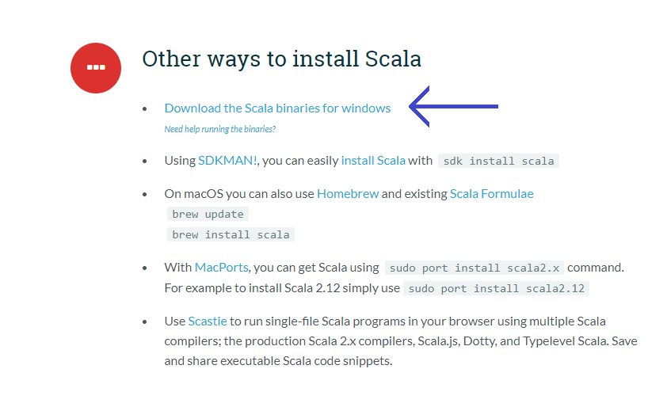

# Interactive kdb-studio

Interactive kdb-studio is an extension for Visual Studio Code. This extension lets you select q code and execute it in the kdb-studio REPL by a quick keyboard shortcut.

**q Syntax (official) extension.**

## Features

The extension will automatically open a new integrated terminal and initialise the Scala interpreter with kdb-studio upon opening a `.q` file.

Once in a `.q` file, you can select a subset of your Scala code and use the keyboard shortcut `alt+enter` to quickly execute the code in the kdb-studio or `ctrl+alt+enter` to execute a whole file at once. `ctrl+alt+r` allows you to reset Interactive Scala and start from scratch.`ctrl+alt+s` lets you to change the kdb server. It will scan the openend `.q` file and scan for a string like `/ qsv.q:localhost:8888::`. It will then define this server on kdb-studio and switch to it.
The shortcuts can be changed in your VS Code settings.

If you are to send single line to the interpreter, there's no need for selection at all! Just place the caret on the line and press the shortcut.

Shortcuts are not your style? You can now use the context menu as well! Just select some code and right click to send it to the interpreter.

## Extension Settings

The used REPL Scala interpreter can be changed through the VS Code preferences. You can choose any Scala interpreter you like, including `scala` (default) and `sbt console`. 
The first of which is using the system-wide Scala installation through the `scala` command. `sbt console` uses the Scala Build Tool thourgh the `sbt` command and will use the local project installation. Please note, that SBT will instantiate a new project, if none is found in the working directory. 

Using `sbt console` is a bit slower initially, as SBT will compile and check for updates before entering the interpreter.

## Requirements

Different requirements are applicable for the interpreter options.

### scala
If you are using the system-wide Scala installation, you must have installed the Scala binaries and added the `scala` command to PATH.
https://www.scala-lang.org/download/

### sbt console
If you are using the project installation, you must have SBT installed. You should also have a Scala project in your working directory, otherise SBT will automatically instantiate it when you are using this extension.
https://www.scala-sbt.org/download.html

## Known Issues

The default shell for the integrated terminal on Windows (PowerShell) is known to cause problems with manual input to the Scala interpreter. 
Change the shell to e.g. Git Bash as a workaround.

## Release Notes

### 1.0.0

First stable version.

Added:
- Automatic opening of Scala interpreter.
- Shortcut to execute Scala code in interpreter.